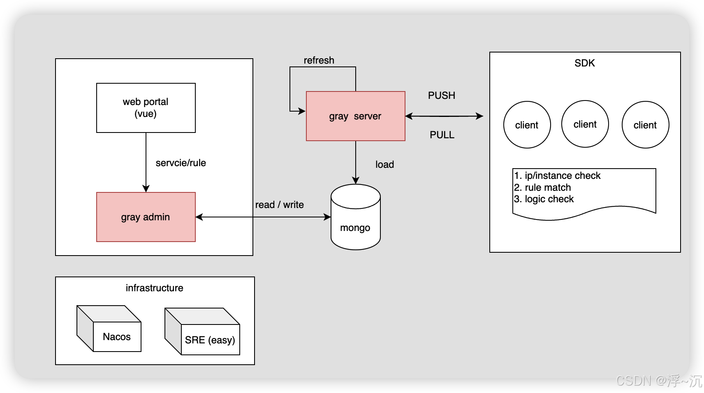

# open-gray-sdk

## 整体架构

## 功能描述
提供两种灰度能力： 基于实例的流量灰度、基于业务参数的业务灰度

+ 基于URL和方法粒度提供新老服务、新老接口的切换 
+ 基于Nacos实例上下线来灵活控制指定实例的流量比例，稳健、安全可靠的切入新流量 
+ 灰度配置修改实时生效（热发布）：用户在修改完配置并发布后，客户端能实时（1秒）接收到最新的配置【推拉结合】，并通知到应用程序 
+ 版本管理，每次配置变更都伴随版本变化，业务方可以灵活加载最新版本的配置到应用程序，也可以选择维持现状 
+ 权限管理，部门之间的灰度配置隔离 
+ 可视化配置 
+ 变更及时发布通知能力

## 快速开始
1. 部署admin： open-g
2. 部署server
3. 引入sdk 

## 沙箱验证
1. 业务灰度
TODO 
2. 流量灰度
TODO 
+ 上游服务可以多选，让多个上游同时可以选择一个下游灰度服务
+ 将基于url移动到流量灰度
